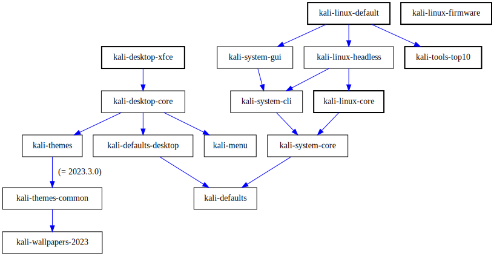

# Kali Meta

All the Kali Linux metapackages.

For a "standard" Kali installation, the following packages are installed: `kali-linux-firmware kali-linux-core kali-desktop-xfce kali-tools-top10 kali-linux-default`, leading to that kind of graph:

For a "purple" installation, the following packages are installed: `kali-linux-firmware kali-system-gui kali-themes-purple kali-desktop-xfce kali-tools-(identify|respond|detect|protect|recover)`, leading to:

